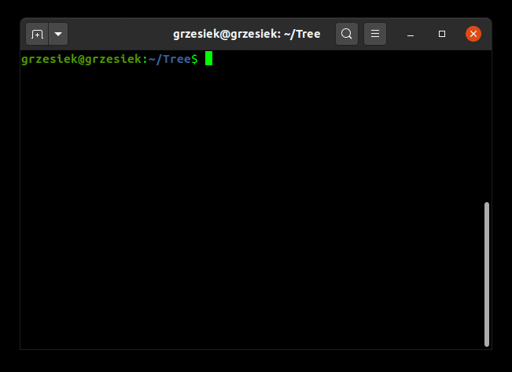

# Tree
> Lists the contents of directories in a tree-like format.

# How to use
### For example:

This command prints all files and folders begining from /home directory.
```sbtshell
java -jar NameOfGeneratedJar.jar ./home -a
```
Print help.   

```sbtshell
java -jar NameOfGeneratedJar.jar -h
```



# How to contribute
### This project is constructed that is very simple to implement new functionality.   
### You have only to do:

* Create new class inside traverse package that names will be like its functionality.
* Extends this class with the AbstractTree class from root package.
* You must override only two methods to add new functionality.
```java
void createLeaf(String prefix, File file, String leftLeaf, String rightLeaf);
void printTree(String directory);
```
 * Add new shortcut to Arguments enum class.
 * Add this shortcut to Help class.
 * Add new condition to Main class.
 
 #### Tree use help from [JColor](https://github.com/dialex/JColor) library to colorize some printed strings. You can simply use its too.
